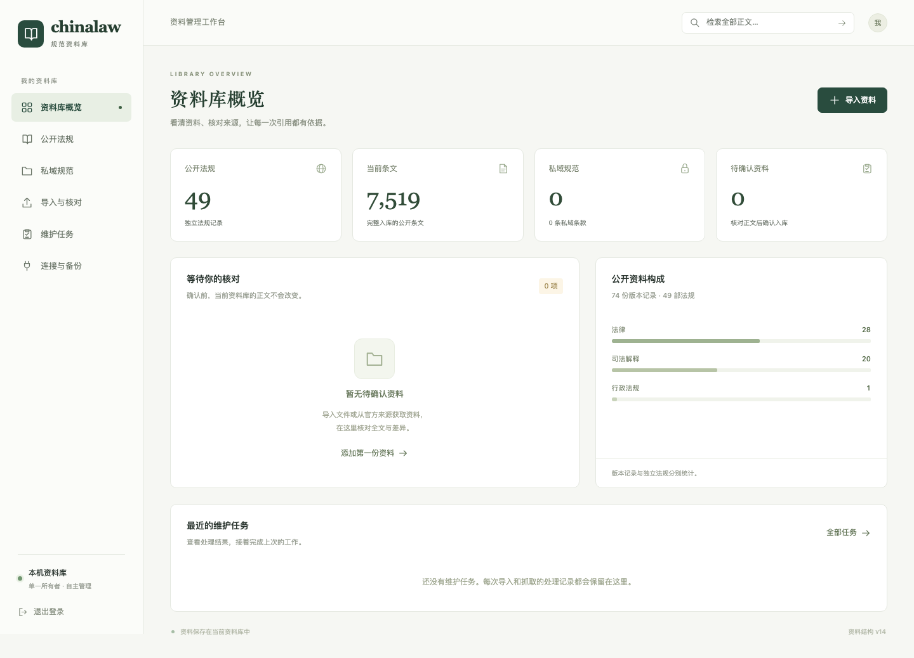

<h1 align="center">chinalaw</h1>

<p align="center"><strong>面向 AI agent 的本地中国法律法规检索工具</strong></p>

<p align="center">
  <a href="https://github.com/nh59yytyd5-dev/chinalaw-cli/actions/workflows/test.yml"></a>
  <a href="https://github.com/nh59yytyd5-dev/chinalaw-cli/releases"></a>
  
  <a href="LICENSE"></a>
</p>

<p align="center">
  <a href="#安装">安装</a> ·
  <a href="#快速开始">快速开始</a> ·
  <a href="#接入-agent">接入 agent</a> ·
  <a href="#资料库管理面板">管理面板</a> ·
  <a href="#文档">文档</a>
</p>

`chinalaw` 把公开法律、行政法规和司法解释整理成一个本机 SQLite 资料库，让 Codex、Claude Code、Cursor 这类能调 shell 的 agent 在做合同审查、写法律备忘录或核对引用时先查规范、再回答。返回的每一条条文都带来源 URL、核查时间、效力状态和内容哈希：人可以复核，agent 不能凭记忆编造。

```console
$ chinalaw article 民法典 524 --format card
《中华人民共和国民法典》§524: 债务人不履行债务，第三人对履行该债务具有合法利益的，第三人有权向债权人代为履行；但是，根据债务性质、按照当事人约定或者依照法律规定只能由债务人履行的除外。 债权人接受第三人履行后，其对债务人的债权转让给第三人，但是债务人和第三人另有约定的除外。
source: current | flk.npc.gov.cn | https://flk.npc.gov.cn/detail?id=ff808081729d1efe01729d50b5c500bf | 核查 145 天前
```

## 特性

- **本地优先**。资料库就是一个 SQLite 文件，默认在 `~/.chinalaw/chinalaw.db`；合同、案件材料和公司制度不出本机。
- **条文级引用**。按法规名、俗称、条号或关键词直接定位到条，JSON 与 Markdown 两种输出。
- **随包语料**。内置 74 份完整、可引用的公开规范文本，`chinalaw init` 一条命令装好，不需要联网。
- **缺失即报错**。本地没有的法规或条文返回明确诊断（`law_missing`、`article_null`、`needs_fetch`），不会让 agent 误以为引用成功。
- **按需补全**。从 12 个官方公开来源抓取、清洗、入库，保留来源与哈希；节流和合规边界见 [docs/COMPLIANCE.md](docs/COMPLIANCE.md)。
- **私域规范**。公司制度、甲方要求、行业标准也能入库检索，输出始终标明它们不是国家法。
- **管理面板（可选）**。在浏览器里浏览、核对和维护资料库，并以只读 REST / MCP HTTP 供远程 agent 查询。
- **稳定契约**。命令、JSON 字段和退出码按 [docs/CONTRACT.md](docs/CONTRACT.md) 演进；CLI 核心没有第三方依赖。

## 安装

需要 Python 3.10 或更高版本。

macOS / Linux / WSL：

```bash
git clone https://github.com/nh59yytyd5-dev/chinalaw-cli.git
cd chinalaw-cli
scripts/setup-agent
```

Windows PowerShell：

```powershell
git clone https://github.com/nh59yytyd5-dev/chinalaw-cli.git
cd chinalaw-cli
.\scripts\setup-agent.ps1
```

`setup-agent` 会创建仓库内的 `.venv`，把 `chinalaw` 和 `chinalaw-mcp` 写到 `~/.local/bin`（Windows 为 `%USERPROFILE%\.local\bin`），首次运行时加载内置公开规范并做健康检查。命令找不到时把该目录加入 `PATH`。

更新：`git pull` 后运行 `scripts/update-local`（Windows：`.\scripts\update-local.ps1`）。不安装也可以在仓库内直接运行 `PYTHONPATH=src python3 -m chinalaw ...`。

## 快速开始

```bash
chinalaw init                                    # 加载内置公开规范基线并做健康检查
chinalaw resolve 民法典 --format json             # 俗称 / 简称解析到正式记录
chinalaw search 合同效力 --kind article --limit 5 --format md
chinalaw article 民法典 第一百四十三条 --format md
chinalaw articles 民法典 --numbers "143,464,509,577" --format json
chinalaw outline 民法典 --limit 20 --format md
chinalaw doctor --format md                      # 安装、数据库、MCP 与 skills 健康检查
```

本地缺少某部法规或某条条文时按需补全：

```bash
chinalaw ensure 劳动合同法 --format json           # 本地已有则跳过，缺失才抓取
chinalaw fetch 民法典 --article 第五百八十五条 --format json
```

`fetch` 访问公开官方来源，可能受上游改版、网络和限流影响，脚本里应检查返回的 `ok`、`error` 和 `source_*` 字段。默认输出 JSON，多数命令支持 `--format md`。完整命令与字段说明见 [docs/CONTRACT.md](docs/CONTRACT.md)，更多示例见 [docs/EXAMPLES.md](docs/EXAMPLES.md)。

## 接入 agent

把下面这段放进 Claude Code、Codex、Cursor 或 OpenCode 的全局规则：

```text
涉及中国法、法条、司法解释、合同审查、劳动/公司/民商事/刑事问题时，
先使用本机 chinalaw CLI 查询，不要凭模型记忆回答。
常用命令：
- chinalaw resolve <name> --format json
- chinalaw search <query> --kind article --limit 10 --format json
- chinalaw article <law> <number> --format json
- chinalaw articles <law> --numbers <nums> --format json
- chinalaw ensure <law> --format json
如果返回 law_missing、law_stub、law_seed、article_null 或 needs_fetch，
按诊断信息补全，或明确告知本地数据不足。
```

仓库自带 7 份 skill（检索方法、引用核对、合同审查、法律研究等），默认只作为文档随仓库分发；需要全局加载时执行 `scripts/install-skills --copy`（Windows：`.\scripts\install-skills.ps1`），`--uninstall` 可移除。调用顺序、输出纪律、语料安装和 grounding 快照审计见 [docs/AGENT_WORKFLOWS.md](docs/AGENT_WORKFLOWS.md)。

### MCP

偏好 MCP 的客户端可以用 stdio 服务器 `chinalaw-mcp`（可加 `--db` 指定资料库）。它是同一组 CLI 能力的薄封装：`chinalaw_resolve`、`chinalaw_search`、`chinalaw_article`、`chinalaw_articles`、`chinalaw_applicable`、`chinalaw_ensure`。私域规范默认不经 MCP 暴露，确需时加 `--allow-private-norms` 启动。管理面板服务另外提供带 OAuth 的只读 MCP HTTP 端点。

## 资料库管理面板

面板是可选组件：在浏览器里看清库里有什么、逐条核对入库文本、审阅差异后再确认写入；同时提供只读 REST 与 MCP HTTP，供多台设备上的 agent 查询同一套资料库。

<p align="center"></p>

```bash
scripts/install-local --with-server     # Windows：.\scripts\install-local.ps1 -WithServer
chinalaw-server init --with-fixtures
chinalaw-server serve --open            # 终端输出一次性配对链接，进入面板后可设置密码
```

- 上传文件或从官方来源抓取都先生成预览：完整正文、原件、增删改差异，人工核对后才入库，核对记录绑定具体内容版本。
- 单所有者登录，可签发和撤销只读令牌；MCP 客户端走 OAuth / PKCE。
- 备份包含来源附件，可校验、预览冲突后事务性恢复，用于在本机与服务器之间迁移。
- 自托管使用仓库内的 `Dockerfile` 与 `deploy/compose.yaml`（Caddy 反向代理与 HTTPS）。

运行面板不需要 Node.js 或任何模型 API。操作、部署和客户端接入见 [docs/ADMIN_SERVER.md](docs/ADMIN_SERVER.md)。

## 私域规范

公司制度、甲方放款要求、内部合规手册、行业标准可以和公开法规一起检索，但只存本机、不随包分发，输出层始终标明**它们不是国家法规范**：检索命中带 `hierarchy: "private_norm"` 与约束力提示 `binding_note`，与公开法同时命中时附 `conflict_notice`。

```bash
chinalaw norm import data/norms/acme-lending-policy.json --format json   # 随仓库的虚构示例
chinalaw norm ingest path/to/policy.md --name "内部合规手册" --source-type internal_governance
chinalaw search 担保审批 --kind norm --format md
```

`ingest` 支持 txt / md / docx / pdf，按“第 N 条”切分并识别章节层级；`norm history` / `norm diff` / `norm delete` 管理生命周期，`norm export` 附防泄漏标注。`--source-type` 的受控取值见 [docs/CONTRACT.md](docs/CONTRACT.md) §2.9。

## 语料与来源

内置 74 份完整公开规范文本：宪法与刑法的历次文本、民法典、民事 / 刑事 / 行政诉讼法、公司法、劳动合同法、个人信息保护法等，以及民法典配套解释和主要的诉讼、合同、劳动司法解释。完整清单见 [docs/DATA_INDEX.md](docs/DATA_INDEX.md)。

已实现 12 个官方来源适配器：国家法律法规数据库（`flk_npc`）、国家行政法规库（`gov_xzfgk`）、最高人民法院公报与主站（`court_gongbao`、`court_main`）、最高人民检察院（`spp_gov_cn`）、证监会（`csrc_gov_cn`）、国家金融监督管理总局（`nfra_gov_cn`），以及沪深北交易所、中国结算和证券业协会的规则。抓取遵守 [docs/COMPLIANCE.md](docs/COMPLIANCE.md)：低频、只取公开文本、保留来源与哈希。

```bash
chinalaw sources list --implemented-only --format md
chinalaw sources show flk_npc --format json      # 每个来源支持的命令边界
```

## 命令速查

| 命令 | 用途 |
| --- | --- |
| `init` | 加载内置公开规范基线并运行健康检查 |
| `resolve <name>` | 俗称 / 简称解析到正式记录 |
| `search <query>` | 全文 / 条文检索，`--kind` 限定范围 |
| `article <law> <number>` / `articles <law> --numbers ...` | 单条 / 批量取条 |
| `outline <law>` | 章节目录与正文预览 |
| `ensure <law>` / `fetch <law>` | 本地优先补全 / 从来源抓取入库 |
| `history` / `diff` / `applicable` / `relation` | 版本历史与时间效力线索 |
| `norm ...` / `pack ...` | 私域规范 / 规范包管理 |
| `audit <target>` / `cite-check <file>` | 审查文件中的法条引用是否可解析、文本是否一致 |
| `doctor` / `status` | 本机健康检查与数据新鲜度 |
| `chinalaw-mcp` / `chinalaw-server` | stdio MCP / 管理面板与 HTTP 服务 |

## 文档

- [docs/ADMIN_SERVER.md](docs/ADMIN_SERVER.md)：管理面板与服务器的使用、部署和客户端接入。
- [docs/AGENT_WORKFLOWS.md](docs/AGENT_WORKFLOWS.md)：agent 调用顺序、输出纪律、语料安装与 skills。
- [docs/CONTRACT.md](docs/CONTRACT.md)：CLI / JSON / 退出码契约与数据模型。
- [docs/EXAMPLES.md](docs/EXAMPLES.md)：可执行的调用示例。
- [docs/DATA_INDEX.md](docs/DATA_INDEX.md)、[docs/COMPLIANCE.md](docs/COMPLIANCE.md)：内置数据与来源抓取边界。
- [docs/ARCHITECTURE.md](docs/ARCHITECTURE.md)、[docs/CLEANING.md](docs/CLEANING.md)：代码结构与清洗规则。
- [docs/PROJECT_CHARTER.md](docs/PROJECT_CHARTER.md)：项目定位与不做的范围。
- [CHANGELOG.md](CHANGELOG.md)、[SECURITY.md](SECURITY.md)、[NOTICES.md](NOTICES.md)。

## 参与开发

```bash
python3 -m venv .venv && . .venv/bin/activate
python -m pip install -e ".[dev,server]"
ruff check src tests tests_server
python -m pytest tests tests_server -q
scripts/check-public-fixtures
```

面板前端在 `web/`（Node 22）：`npm ci && npm run build` 构建，`npm test` 跑浏览器验收（需先 `npx playwright install chromium`）；构建产物写入 `src/chinalaw/server/static/`，随源码一起提交。贡献流程见 [docs/CONTRIBUTING.md](docs/CONTRIBUTING.md)，模块边界与测试要求见 [docs/DEVELOPMENT_GUIDE.md](docs/DEVELOPMENT_GUIDE.md)。三条底线：法条缺失必须 fail loud；修复应是一类问题的通用规则，不为单部法规打补丁；新增外部来源先说明来源、节流、清洗、追溯与失败模式。

问题与建议请开 [GitHub Issues](https://github.com/nh59yytyd5-dev/chinalaw-cli/issues)，安全漏洞请按 [SECURITY.md](SECURITY.md) 私下报告。友链：[Linux.do](https://linux.do/)。

## 许可与免责声明

代码采用 [Apache License 2.0](LICENSE)，第三方依赖与数据来源登记见 [NOTICES.md](NOTICES.md)。法律、法规及国家机关的决议、决定、命令等依《著作权法》第五条不适用著作权法保护；第三方网站、释义材料、商业数据库和用户私域材料仍须遵守各自的权利与使用限制。

本项目只提供规范文本的检索、整理和引用便利，不构成法律意见。实际案件和交易应由执业律师或法务判断，并以官方发布渠道的最新文本为准。
