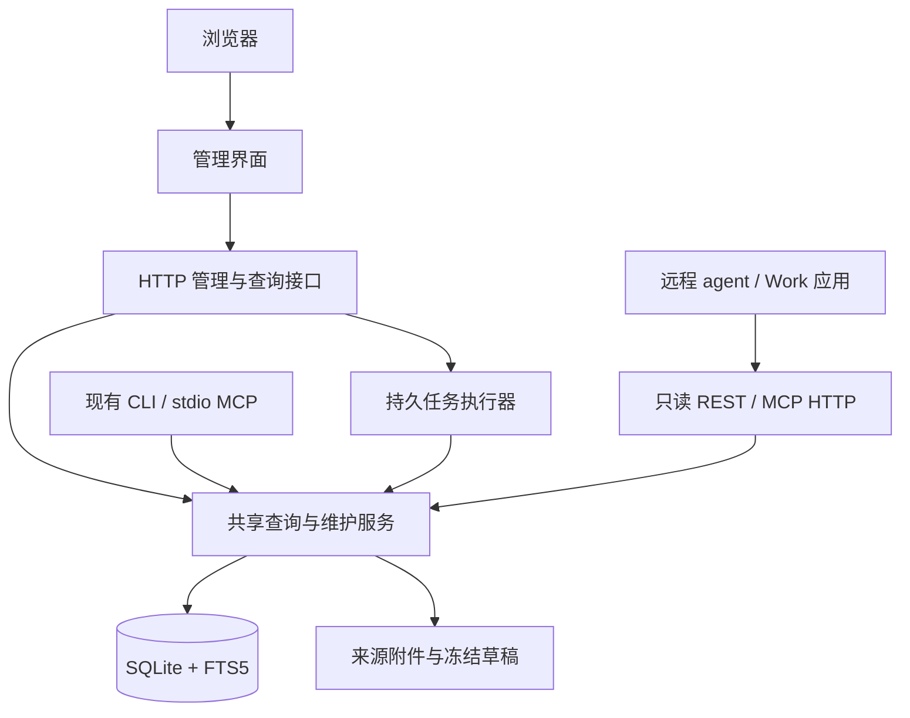

# chinalaw 资料库管理服务：需求、调研与实施计划

> 状态：已实施（2026-09-22）。§8.2 的外部 OIDC/Keycloak 候选已被内置 MCP SDK 授权服务取代，
> 见实施记录 [ADMIN_PANEL_IMPLEMENTATION_20260913.md](ADMIN_PANEL_IMPLEMENTATION_20260913.md)；
> 面向使用者的操作与部署说明见 [ADMIN_SERVER.md](ADMIN_SERVER.md)。

日期：2026-09-13。需求经本次讨论确认；实施基线为 `335c23b`、chinalaw 0.5.1、数据库 schema 13。下一功能版本建议为 0.6.0。

## 1. 结论

建议开发。新增能力定位为供开源使用者管理、核对自己资料库的服务，包含浏览器面板、共享业务接口、本机与服务器两种运行方式、远程只读查询和备份迁移。

必要性来自目前明确的使用障碍：使用者难以知道库内有什么、难以完整核对入库条文，维护操作依赖命令行或 agent。已有 CLI 技术上可以人工调用，但缺少普通使用者可以独立完成的发现、核对、确认和追踪流程。

技术上可行：现有 Python 业务模块、SQLite、清洗和版本记录能复用。新增工程主要集中在完整预览与确认入库、持久任务、权限、来源附件保存、部署和备份恢复。服务器端不能通过给现有 CLI 加几个网页按钮来完成。

这份调研验证了需求与方案的适配性，没有把一次需求讨论当作整个开源用户群的市场调查。发布前仍应观察首次使用者能否独立完成下列验收任务。

## 2. 已确认需求

| 项目 | 已确认范围 |
| --- | --- |
| 使用者 | 所有开源安装者，各自管理自己的资料库 |
| 核心问题 | 看清库内法规、完整条文和来源，核对内容是否正确入库 |
| 人工维护 | 重新抓取或导入，完整预览和比较差异，再确认替换 |
| 资料种类 | 公开法规和私域规范都覆盖，明确显示来源、性质和约束范围 |
| 本机部署 | 本机启动服务，通过浏览器操作本地资料库 |
| 服务器部署 | 一个所有者的一套资料库，多个平台访问同一个服务 |
| 远程 agent | 查询资料；首版写入与维护由人工面板完成 |
| 两种部署的数据关系 | 使用备份或导入导出迁移，不做自动双向同步 |
| 模型依赖 | 核心流程不依赖 Kimi 或任何付费模型额度 |

首版范围外：多人协作、租户隔离、逐条在线改写法规正文、双向同步、模型 OCR、自动法律判断、公开托管服务和商业平台插件上架。上述内容不影响本机和单用户服务器版本必须共同交付。

## 3. 使用流程与页面

### 3.1 资料库浏览

首页显示公开法规记录数、可用版本数、当前条文数、私域规范数，以及需要处理的导入和失败任务。不同统计口径分别标明。

法规目录支持关键词、现有规范类型、状态、来源等筛选和分页。资料详情展示全文、章节目次、条号定位、版本记录、取得时间和来源。长条文提供完整阅读，不以搜索摘要或预览字数代替正文。

公开法规与私域规范在导航和每条结果中均可区分。沿用已有 `level`、`source_type`、`authority`、`binding_scope` 和效力提示，不新设法律分类或效力排序。

“已入库”“存在结构警告”“已人工核对”与法规效力状态分别显示。结构检查和 hash 一致只能说明特定技术条件满足；人工核对记录绑定具体内容版本，内容变化后不能继续显示旧版本已经核对。

### 3.2 公开法规重新抓取

1. 搜索来源候选，核对名称、版本和来源后选择。
2. 在后台获取、清洗并生成待确认草稿，不改现有正文。
3. 展示完整待入库正文、结构检查结果、来源，以及与当前库中内容的增删改差异。
4. 使用者确认后提交冻结的草稿；确认时不重新抓取另一份文本。
5. 返回本次变更和入库结果，能立即从正文页核对，并保留维护记录。

### 3.3 文件导入与私域维护

文件上传后选择公开法规或私域规范，填写必要元数据，查看解析出的完整条文、章节目次和警告，再确认入库。已有资料再次导入时先比较差异。

公开法规优先支持官方来源抓取和 canonical JSON 导入，并接入现有 cleaning 支持的文本文档格式；私域支持现有 txt、md、docx、具有文本层的 PDF。PDF 抽取能力按运行环境检测，缺少工具时给出可执行的安装说明。扫描 PDF 的模型 OCR 不进入首版。

上传原件以资料库附件保存，后续可以查看或下载。已有资料如果只留有出处和规范化快照，界面如实展示，不能假定历史原文件仍存在。公开网页不能嵌入时提供来源链接，不把重新获取的网页冒充历史原件。

### 3.4 维护与接入

面板提供任务状态、失败原因、重试、历史记录、按版本恢复的预览入口、备份下载和恢复迁移，以及远程查询凭据管理。人工不需要编辑数据库或执行 shell。

远程应用连接查询接口，缺失资料时得到结构化错误；查询不会隐式抓取、导入或迁移数据库。

## 4. 必要性与替代方案

| 方案 | 能解决什么 | 对本次需求的不足 | 判断 |
| --- | --- | --- | --- |
| 增强 CLI、导出 HTML 报告 | 降低部分查看成本，改动小 | 持续维护、确认入库、服务器接入和多端共享仍缺统一流程 | 可作辅助，不能完成已确认范围 |
| Datasette 等现成 SQLite 面板 | 现成的数据浏览和 JSON API，可通过插件扩展 | 法规/版本/条文语义、来源核对、冻结草稿、私域权限仍需定制；直接表写入会绕过清洗和索引维护 | 可借鉴，不作为本项目核心管理层 |
| 新增 Python 管理服务，复用既有业务层 | 同时支持人工和远程程序，复用现有解析、校验、索引和来源规则 | 需要承担接口、任务、鉴权、UI 和部署维护 | 推荐 |
| 全量迁移至新的 ORM/数据库/大型后台框架 | 可获得更多通用后台能力 | 当前单用户需求不要求替换 SQLite，也没有必要重写现有数据模型与迁移体系 | 暂无足够收益 |

Datasette 官方文档确实支持自定义插件和路由，因此它并非“不能维护”；本项目选择业务接口的原因是需要保持 canonical payload、来源和版本的一致性，而不是表格 CRUD 的数量。[R1]

## 5. 现有实现与验证证据

| 能力 | 现有入口 | 下一步 |
| --- | --- | --- |
| 法规目录、全文、条文 | `service.list_laws/get_law/get_article/outline_law` | 补完整分页、统一筛选、只读调用边界 |
| 健康统计 | `service.status`、`doctor.run_doctor` | 转为可操作的页面与诊断 |
| 抓取候选与预览 | `fetch.fetch_law(list_matches/dry_run)` | 增加持久草稿和对同一草稿的确认提交 |
| 私域导入和版本比较 | `normsources.import_text_source_file/list_revisions/diff_revisions` | 预览全文、保存上传原件、统一人工流程 |
| 入库与索引 | `loader.load_law_from_dict`、私域导入模块 | 继续作为写入入口，避免 HTTP 层直接改条文表 |
| 同步断点 | `sync.py` 页级检查点 | 增加用户可见、可恢复的任务记录 |
| MCP | 当前 `mcp.py` 为 stdio，协议常量为 2025-06-18 | 增加独立 HTTP adapter，保留现有 stdio 行为 |
| 远程只读 | 现有工具还包含会写库的 `chinalaw_ensure` | 明确列出远程只读工具，不能直接全量暴露现有工具集 |
| 来源原件 | 来源字段、hash、规范化快照、部分本地路径 | 新导入件持久保存，历史缺件如实标记 |
| 备份 | SQLite 有成熟在线备份机制，当前无完整产品入口 | 加资料库、附件清单、校验和恢复流程 |

2026-09-13 已使用临时数据库、仓库公开 fixtures 和虚构私域文本验证：

- 加载后得到 schema 13、49 条法规记录、74 条修订记录、7,519 条当前条文。74 个 fixture 不等于 74 个独立法规记录。
- `get_law` 返回民法典 1,260 条正文，单条查询返回完整文本。
- 私域 dry-run 不写入当前资料；示例条文完整文本 192 字，现有预览仅 120 字，且不含完整 `text` 字段。
- 连续导入生成修订 1、2，可读取历史和差异。
- 使用 SQLite 在线备份后，法规、条文、私域规范和条款数量一致。

这些验证证明现有模块可复用，不等同于已验证新 Web 服务、远程鉴权或生产性能。本次没有对用户正在使用的数据库执行迁移或写入。

## 6. 推荐技术与模块边界

建议 Python + FastAPI/Uvicorn 管理服务，TypeScript 浏览器界面，保留 SQLite/FTS5，并使用官方 MCP Python SDK 实现 HTTP transport。前端具体组件选择服从目录、全文阅读和差异核对需要。

FastAPI 提供 OpenAPI、校验和依赖注入，适合包装现有 Python 函数，不要求替换数据库。[R2] 调研时 FastAPI 0.141.1、Uvicorn 0.52.4、MCP SDK 2.2.0 的 Python 要求均为 3.10+，与项目相符；实施时锁定经过测试的依赖范围。

实现约束：

1. CLI 核心继续保持轻依赖；服务端通过可选安装项加载。仅使用 CLI 的用户不必安装 Web/MCP HTTP 依赖。
2. 发布产物包含构建后的前端；运行时不要求 Node.js、不拉取 CDN 组件，不调用模型。
3. HTTP、任务与 MCP 复用公开业务模块。新增查询、预览、提交、备份接口落入共享模块，避免业务逻辑进入路由。
4. 请求只能操作服务器配置的资料库和受管附件 ID，不接受任意文件路径、SQL 或 shell 命令。
5. 只读接口不创建库、不自动迁移。显式初始化/升级在服务接收请求之前完成。
6. 来源 hash 继续保留现有含义；新增草稿/内容指纹负责一致性校验，不能把现有 `source_hash` 一律当作原文件字节 hash。

## 7. 入库一致性与数据设计

### 7.1 冻结草稿

草稿至少包含资料类型、目标 ID、规范化 payload、来源/附件引用、当前内容版本指纹、草稿指纹、警告、创建时间和状态。

预览读取保存的草稿。提交在短事务内重验当前版本：版本不同返回冲突，提示重新比较；重复确认返回同一次结果。网络获取和解析不能占用写事务。

确认后通过现有 loader / norm 导入接口写正文、索引和版本，并同事务记录变更。写入后的完整内容须与确认的规范化内容一致。失效草稿、异常、取消和磁盘不足不能破坏已有资料。

旧库初次进入面板时，允许从现有完整内容建立维护基线；不可伪造缺失的原件或历史人工核对记录。

### 7.2 管理记录

需要持久保存导入草稿、任务、维护事件、人工核对记录和附件引用。新增 schema 必须包含 migration，兼容从 schema 13 升级；已有 JSON 命令的字段和含义保持兼容。

维护历史与法律修订历史分别展示：一次重新导入不必然代表法律发生修订。人工核对和恢复操作绑定具体内容版本。

原件先安全落盘，再提交附件引用；异常留下的无引用临时文件可清理，不允许库内引用不存在的已提交附件。原件使用受管名称和大小限制，正文按文本渲染。

### 7.3 任务

区分排队、运行、等待确认、完成、失败、取消和中断。首次实现以单个受控 worker、有限队列和短事务为基线；网络请求、解析和数据库写入分别有可解释的失败原因。

关闭页面不丢任务；服务重启后仍能看到结果，未完成工作显式标记中断。重试是可追踪的新尝试，不能把重复提交当作第二次导入。长任务不能仅靠 FastAPI 的进程内 `BackgroundTasks` 当作持久队列。[R3]

## 8. 远程查询与鉴权

提供两种互补入口：稳定的只读 REST API 供程序调用，MCP Streamable HTTP 供支持 MCP 的客户端调用。REST 同时服务浏览器；MCP adapter 只包装查询能力。

远程工具集合不包含 `ensure`、抓取、导入、删除、恢复、初始化和任意路径导出。缺失内容返回诊断，由人工面板维护。权限必须在服务端执行，不能仅隐藏按钮或删除工具说明。

### 8.1 两类凭据

- 浏览器所有者使用登录会话；本机模式可采用一次性配对，服务器模式启用所有者身份校验。
- 可以配置 Bearer token 的客户端使用可撤销的只读访问令牌。
- 要求交互授权的托管应用使用 OAuth 2.1：保护资源元数据、真实授权服务、PKCE、令牌受众和权限校验组成完整接入路径。

公开法规查询和私域访问授权分别控制。默认查询令牌只访问公开法规；使用者明确授予后才允许读取私域。权限同时作用于搜索、正文、目录、版本和统计，避免从其他入口泄漏。

单用户部署只授权该资料库所有者。外部身份服务签发了有效令牌，不代表该身份自动拥有此库权限。

### 8.2 调研发现与决策门

Codex 官方文档列出 Streamable HTTP、Bearer 和 OAuth 支持；OpenAI 的托管插件文档对受保护 MCP 给出了 OAuth 2.1 接入要求。这不能推出所有 Work 应用具有相同的配置入口或账户权限。[R8][R9]

MCP 当前规范为 2026-07-28；现有 stdio 使用旧握手协议。官方 Python SDK 2.x 支持新旧客户端，并可以挂载至 ASGI/FastAPI；需要正确管理应用生命周期。首版单 ASGI worker 也避免旧客户端会话落入另一进程的问题。[R6][R7]

SDK 的资源服务器鉴权不等于完整授权服务器。建议复用成熟 OAuth/OIDC 授权服务，提供开源自托管参考配置；Keycloak 是待验证候选。不得发布指向不存在授权服务的 discovery 元数据，也不得声称静态 token 已经完成托管应用的 OAuth 兼容。[R7][R10]

实施第一阶段必须验证 HTTP 挂载、只读令牌、OAuth 资源服务器、目标客户端配置和私域隔离，并确定可运行的授权服务配置。无法实测的商业客户端列为“未验证”，兼容性声明以实际证据为限。

## 9. 部署、备份与恢复

| 项目 | 本机 | 服务器 |
| --- | --- | --- |
| 服务 | 本机命令启动，浏览器打开 | 容器或直接 Python 服务 |
| 监听与会话 | 默认回环地址，受控本地配对/登录 | 显式绑定地址、HTTPS、所有者登录 |
| 数据 | 使用指定本地库和附件目录 | 同一服务器的持久本地磁盘或本地卷 |
| 多端 | 本机浏览器与本地工具 | 所有终端经 API/MCP 访问同一服务 |
| 迁移 | 导出备份、在目标环境恢复 | 同一备份格式 |

SQLite WAL 允许读写并行，但只有一个写入者，且依赖同机共享内存。多平台应访问服务，不应把活跃数据库放在网络文件系统上供多台机器直接打开。[R4]

备份使用 SQLite 在线备份机制，包含数据库、所引用的来源附件、格式/schema/应用版本、相对路径清单与校验值。[R5] 认证秘密与部署身份独立保存，普通可迁移资料备份不携带可直接复用的登录会话或访问令牌。

恢复先在临时位置验证格式、完整性、路径、附件和 schema；在维护状态下关闭写入和连接，再切换资料。CLI 同时使用该库时也必须协调写入，不能在线替换仍被其他进程打开的文件。失败保留原库；恢复后的未完成任务不得自动执行。

服务端还需同源会话保护、Host/Origin 检查、上传限制和安全附件下载。这些是本机/远程服务的实际边界，不能只依赖“用户知道端口”。[R6]

## 10. 实施顺序与工作量

以下为熟悉项目的单个开发者的工程估计，不是交付日期承诺；包含必要测试与文档。以运行证据更新估计，不据此缩减已确认范围。

| 阶段 | 交付 | 验证门 | 估计工作日 |
| --- | --- | --- | --- |
| P0 架构与接入验证 | 设计记录、可选依赖、HTTP/MCP 与鉴权原型、冻结草稿试验 | 标准客户端可查询；私域隔离；旧 CLI 可运行；授权服务方案明确 | 3–5 |
| P1 共享管理基础 | 分页目录、只读边界、schema、草稿/附件/任务存储 | 旧库迁移；无副作用读取；分页稳定；错误结构化 | 4–6 |
| P2 人工浏览面板 | 首次使用、资料目录、全文/章节目次、来源、版本和统计 | 使用者不借助 agent 找到法规与完整条文 | 4–6 |
| P3 核对与入库 | 上传/抓取、完整预览、差异、确认替换、核对记录与历史恢复预览 | 预览等于入库；并发冲突；重复提交；失败原子性 | 7–10 |
| P4 维护任务 | 持久任务、进度、重试、取消/中断、问题定位 | 页面关闭/服务重启后的状态可解释；已有内容完整 | 4–6 |
| P5 部署与迁移 | 本机启动、容器/服务器配置、远程凭据与 OAuth 配置、备份恢复 | 两种运行方式；查询权限；资料与附件迁移一致 | 5–8 |
| P6 发布验证 | 浏览器端到端、兼容性测试、安装包、文档与协议更新 | 下列验收项逐项有证据 | 4–6 |

合计约 31–47 个工程工作日，即约 6–10 个工程周。OAuth 适配、来源原件取得方式和不同系统的文档解析依赖是主要不确定性。阶段可形成可用增量，但只有浏览页面不能视为完成本次版本目标。

## 11. 完成验收

1. 在本机和服务器配置下，都能独立打开资料目录、筛选、查看完整条文与版本，明确区分公开/私域。
2. 使用公开 fixtures 和虚构文件验证导入。超过 120 字的条文可完整预览，确认内容与入库正文、章节和条号一致。
3. 重新抓取/导入有完整差异，确认前当前库不变；来源或当前内容改变时不能静默覆盖；重复点击不生成第二次操作。
4. 维护事件、版本与人工核对记录可追踪，恢复操作可预览；旧版本的核对状态不会自动套到新内容。
5. 队列、异常、取消、页面关闭、服务重启均有明确状态；错误不留下半部法规或损坏检索索引。
6. 远程 REST/MCP 能读取同一个库；无凭据、撤销凭据、错误受众/所有者和缺少私域权限的请求被拒绝；远程查询不能写库或迁移。
7. 验证新旧 MCP HTTP 客户端和 OAuth 资源服务器流程；给出可操作的客户端接入说明以及已验证/未验证边界。
8. 备份恢复包含原件和版本，恢复失败不影响原库；拒绝不兼容 schema、损坏文件和路径穿越。认证凭据不会随普通资料迁移重新生效。
9. CLI-only 安装和原有 stdio MCP 保持可用；可选 Web 安装、离线静态资源和服务器镜像都能启动。核心流程不调用 Kimi/模型。
10. 运行原有离线测试、lint、fixture 门禁以及新增管理/鉴权/浏览器测试；记录真实运行环境与性能基线。以公开基线和较大合成库检查分页、全文阅读和一写多读。

## 12. 文档与代码交付

工作分支使用 `codex/` 前缀。先提交可审查的设计记录，再分模块实施；不把真正的私域材料、数据库、密钥或访问令牌加入仓库。

同步更新 README、ARCHITECTURE、CONTRACT、安装/服务器部署说明和 EXAMPLES。项目宪章中“不做 GUI”的旧边界需改为允许人工管理与复核入口，同时保留规范来源内核、agent 可调用和可追溯的方向。

本计划不发布站点、不迁移用户现有生产库、不创建付费资源。实际交付为可安装运行、经过验证的代码及部署文档；公开部署和商业平台发布另行操作。

## 13. 调研来源

以下资料于 2026-09-13 实际获取并阅读。协议/SDK 为当日版本，实施时以锁定版本的文档和运行测试核对。

- [R1 Datasette：概述](https://docs.datasette.io/en/stable/)；[插件与自定义路由](https://docs.datasette.io/en/stable/writing_plugins.html)。
- [R2 FastAPI：特性与 OpenAPI](https://fastapi.tiangolo.com/features/)。
- [R3 FastAPI：Background Tasks 的使用边界](https://fastapi.tiangolo.com/tutorial/background-tasks/)。
- [R4 SQLite：WAL、并发及同机限制](https://sqlite.org/wal.html)。
- [R5 SQLite：在线备份](https://sqlite.org/backup.html)。
- [R6 MCP 2026-07-28：Streamable HTTP](https://modelcontextprotocol.io/specification/2026-07-28/basic/transports/streamable-http)；[Authorization](https://modelcontextprotocol.io/specification/2026-07-28/basic/authorization)。
- [R7 MCP Python SDK](https://github.com/modelcontextprotocol/python-sdk)；[ASGI 挂载](https://py.sdk.modelcontextprotocol.io/run/asgi/index.md)；[资源服务器鉴权](https://py.sdk.modelcontextprotocol.io/run/authorization/)；[旧客户端兼容](https://py.sdk.modelcontextprotocol.io/run/legacy-clients/index.md)。
- [R8 OpenAI：Codex MCP 接入](https://learn.chatgpt.com/docs/extend/mcp.md)。
- [R9 OpenAI：受保护 MCP 的授权要求](https://developers.openai.com/plugins/build/auth.md)；[托管插件接入流程](https://developers.openai.com/plugins/quickstart.md)。
- [R10 Keycloak：OIDC 授权、令牌、发现与注册端点](https://www.keycloak.org/securing-apps/oidc-layers)。
- 包元数据：[FastAPI](https://pypi.org/pypi/fastapi/json)、[Uvicorn](https://pypi.org/pypi/uvicorn/json)、[MCP](https://pypi.org/pypi/mcp/json)。
